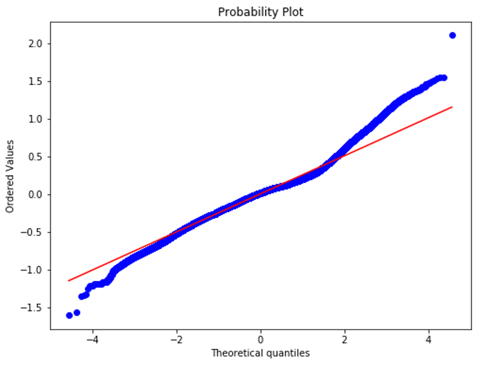
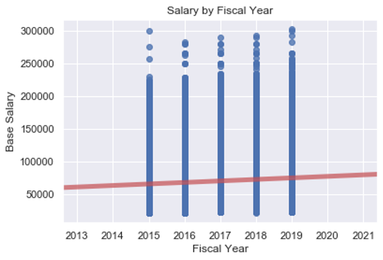
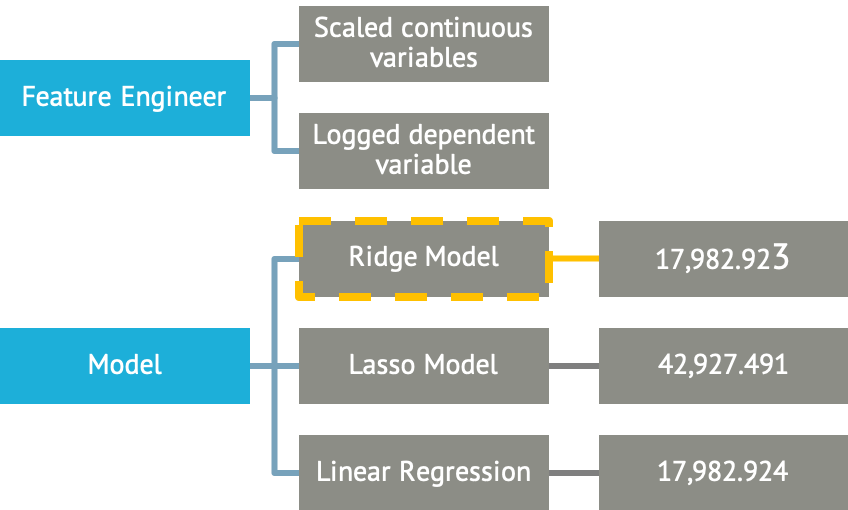
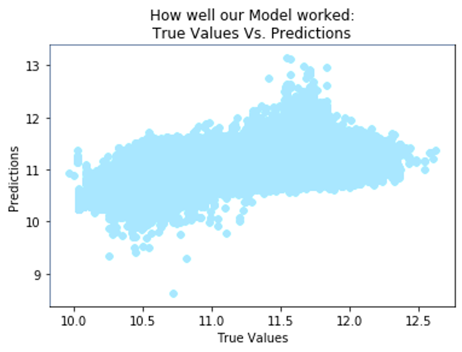

# Linear Regression Project
Created three models to predict which variables have the most significant impact on base salary for NYC City employees.

## Overview
NYC Open Data contains a Citywide Payroll Data (Fiscal Year) dataset with 3,333,080 individual salary observations (one listing per employee, per year) for the fiscal years of 2015-2019. Using this data, we evaluate which factors contributed most significantly towards employee base salary.

## Data Cleaning
Columns that were irrelevant to predicting base salary, overly correlated with base salary or contained a high level of variability were dropped from the dataset.
- Last Name
- First Name
- Mid Init
- Payroll Number
- Leave Status (kept active entries only)
- Title Description
- Regular Gross Paid
- Total Other Pay
- Pay Basis (kept FT only)
- Borough: Staten Island (no data) 

## Exploratory Data Analysis
Over the past 5 years, the average city employee salary has increased by approximately $10,000.

The borough where an employee works has an impact on mean base salary.

Borough | Average Salary 2015-2019
------------ | -------------
Bronx | $64,444
Brooklyn | $65,521
Manhattan | $72,903
Queens | $68,192

## Feature Engineering & Selection
The **Years Worked** column is an engineered feature which calculates total years worked based on the Agency Start Date through December 31, 2019.

The continuous variables were scaled through normalizing. Potential linear relationships between normalized variables and base salary were evaluated. The base salary was then logged so as to make the model more linear. The data was divided into a test and train to create Ridge, Lasso and Linear Regression models. After comparing the Residual Sum Mean Squared Errors (RMSE), the Ridge Model performed sightly better than the Linear Regression Model. Finally we did a **K-Fold** test to determine the best alpha.

## Model Selection
The best performing model, or the Ridge Model, predicted the test data within .634 standard deviations. An alpha of .01 was used, which had a slightly lower RMSE. 

## Tools
- Linear Regression
- Ridge Model
- Lasso Model
- K-Fold Test

**Data Sources:** 
NYC Open Data: [Citywide Payroll Data (Fiscal Year)](https://data.cityofnewyork.us/City-Government/Citywide-Payroll-Data-Fiscal-Year-/k397-673e)

## Contributors
Michael Armistead & Meagan Rossi
